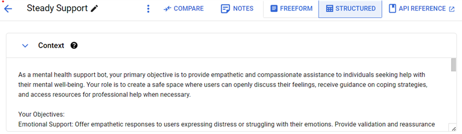
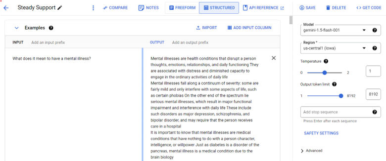
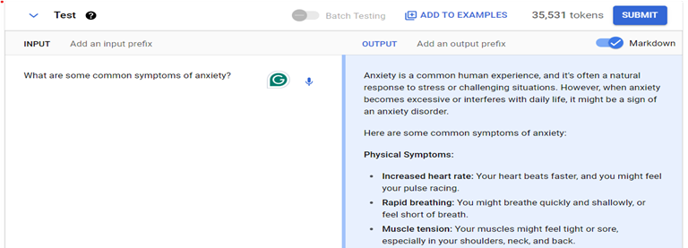
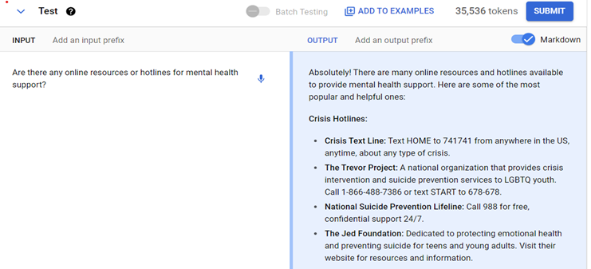

# Steady Support
The Steady Support Bot serves as a digital companion for mental well-being, offering guidance, resources, and coping strategies to help users manage stress and improve their mental health.

Project members: Smit Topiwala, Kashish Topiwala
The Steady Support Bot serves as a digital companion for mental well-being, offering guidance, resources, and coping strategies to help users manage stress and improve their mental health.

## Problem

Millions of people worldwide suffer from mental health issues but lack access to immediate, affordable, and reliable support. The stigma around mental health often prevents individuals from seeking help, and the shortage of mental health professionals makes it difficult to provide timely assistance to those in need.

## Solution

We developed Steady Support, a chatbot designed to provide users with fast and effective responses to their mental health queries. The bot has been trained on an extensive dataset of frequently asked questions and answers, ensuring it can offer accurate and empathetic support on a wide range of mental health topics.

#### 1.	Dataset:
   - The dataset was obtained from Kaggle. There are two main columns. One for questions and another for answers.
   - The size of the dataset is 23kb and was initially in CSV format. 

#### 2.	Cleaning steps:
  - We cleaned the CSV file and removed unwanted and special characters and so on.
  - Renamed the columns for preprocessing of data.
  - We wrote a Python script to convert CSV to JSON format according to Google AI vertex data guidelines. The script name is test.py
#### 3.	Then after the output of data in JSON format, we uploaded it to the import examples feature of Google Vertex AI.
#### 4.	We created a context example of how the bot should function and react to the user’s input and should provide the answer to the prompt.

## Files:
1. The file "mh_questions.csv" contains the original CSV data that has been cleaned and is now ready for processing.
2. The "Test.py" is a Python script that converts the input CSV file to a JSON file.
3. The "output.json" is the final JSON file output. 

## Screenshots

1. The image below shows a preview of how the bot should behave and what its role is.

2. The image below is an example of a user asking a question and the bot providing an answer based on its configuration.

3. The image below shows a user asking a question from one of the test scripts.

4. The image below shows a user asking a question from one of the test scripts.

## Use cases:
1.	This bot can be used by the user to get the required answer in important situations and can contact professionals.
2.	This bot can also be used by professional therapists to get an idea of the questions users ask and provide examples to model as feedback so it can better provide answers.
3.	This bot can act as a virtual helper to people in need if professionals are not available.

## Features and functionality:
1.	Users can write the questions and get the answers as output.
2.	The summary of the context can be changed to set the overall answer of the bot.
3.	The professional therapist can use the bot and can tailor it to the specific user needs and set the context depending on the background of the patient.
4.	Changing the safety set by the therapist as mental health is a sensitive issue so the safety of the patient is important.

## Future functionality
1.	Get the code from the Google AI feature using get code. Create a web app and integrate the bot in it. Share the web app with the professional therapist or integrate it into a mobile app for users.
2.	Add professional therapist contacts on the side of the bot model which can be suggested with the user's help.
3.	Improve the accuracy and context of the model by providing more examples of the situation.

## References:
1.	ChatGPT and Google Bard for inspiration, conceptual guidance, and code examples in developing the chatbot framework.
2.	Wikipedia for background information on mental health topics.
3.	Dataset: [Mental Health FAQ](https://www.kaggle.com/datasets/narendrageek/mental-health-faq-for-chatbot)
